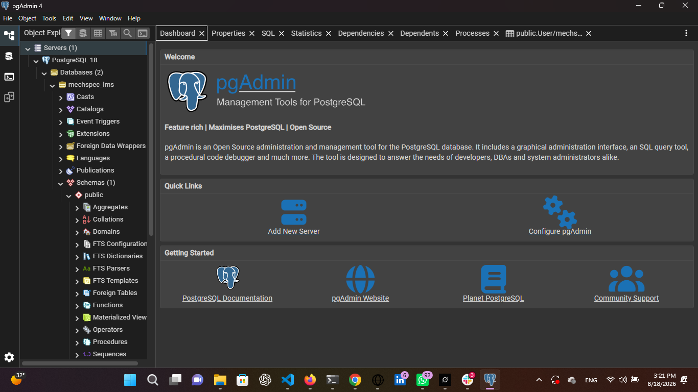
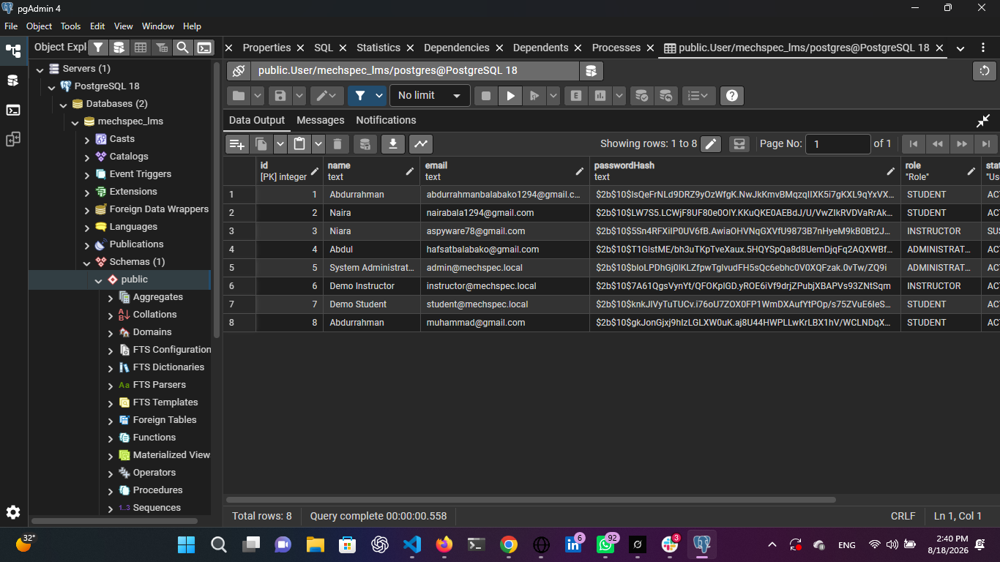
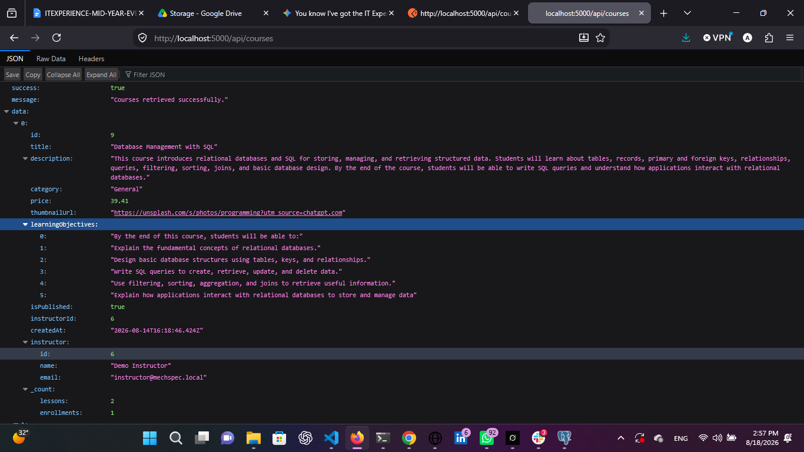
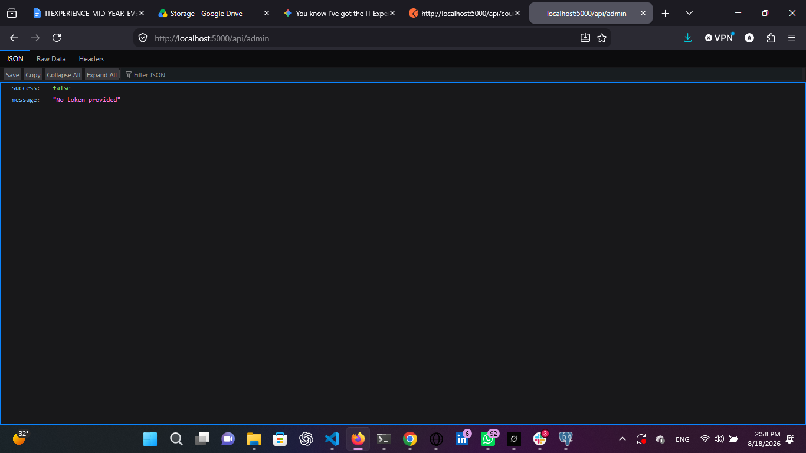
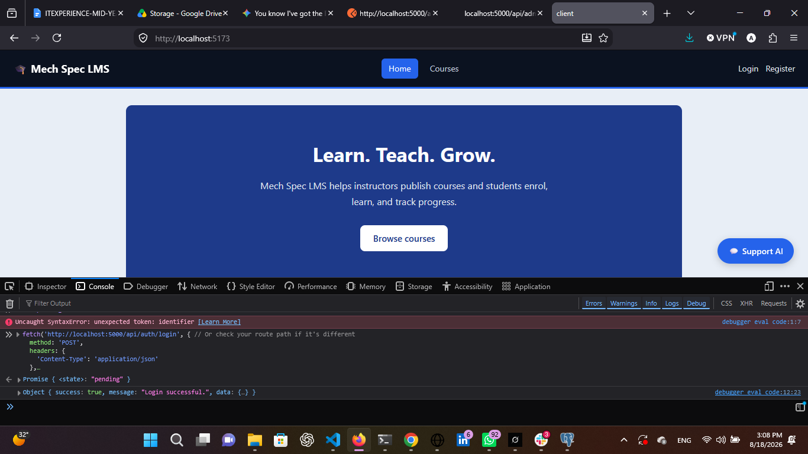
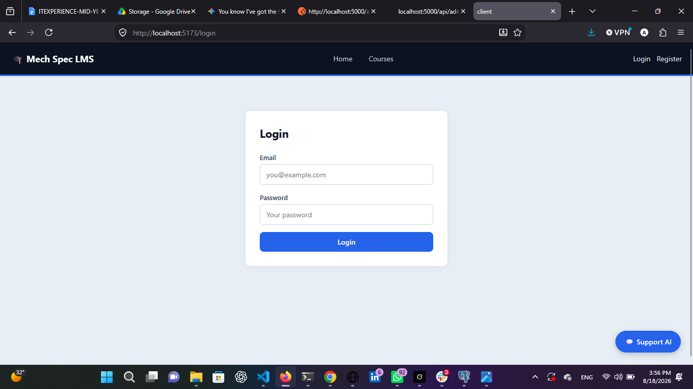

## System Verification & Security Evidence

### 1. Database & ORM Connection Verification
* **Description:** The application successfully connects to the PostgreSQL database via Prisma ORM and pgAdmin. This verifies that database schemas, tables, and data storage are functioning correctly.
* **Evidence:**
  
  *Figure 1: pgAdmin interface displaying successfully queried database tables and records.*

---

### 2. Password Hashing (Bcrypt) Security Evidence
* **Description:** To ensure user credential security, all user passwords are encrypted at rest using the `bcrypt` hashing algorithm, preventing plain-text exposure in the database.
* **Evidence:**
  
  *Figure 2: pgAdmin view showing user records with passwords securely stored as bcrypt hashes (`$2b$` format).*

---

### 3. Public API Endpoint Validation
* **Description:** The backend successfully serves course data through public API routes without requiring authentication, confirming that open resources load correctly for users.
* **Evidence:**
  
  *Figure 3: Raw JSON output serving course records from `http://localhost:5000/api/courses`.*

---

### 4. JWT Authentication Security Control
* **Description:** To prevent unauthorized access, protected endpoints are guarded by authentication middleware. Any HTTP request attempting to access restricted data without a valid token is intercepted and rejected.
* **Evidence:**
  
  *Figure 4: API rejection response (`false, no token provided`) protecting restricted routes.*

---

### 5. Successful User Authentication & Login Flow
* **Description:** Valid users authenticate by submitting their credentials. Upon verification, the server authenticates the user and returns a successful response message and session token.
* **Evidence:**
  
  *Figure 5: Console output confirming successful credential verification and login.*

---

### 6. Frontend Application Interface
* **Description:** The user interface provides an intuitive experience for students and instructors to navigate course offerings and interact with the Mech Spec LMS platform.
* **Evidence:**
  
  *Figure 6: Mech Spec LMS frontend running locally in the browser.*

---

### 7. Authenticated Request Header (JWT Verification)
* **Description:** Upon successful login, the client securely attaches the JSON Web Token in the request headers (`Authorization: Bearer`) to gain access to protected backend routes.
* **Evidence:**
  
  *Figure 7: Browser Developer Tools Network tab displaying the active Authorization Bearer token header.*
